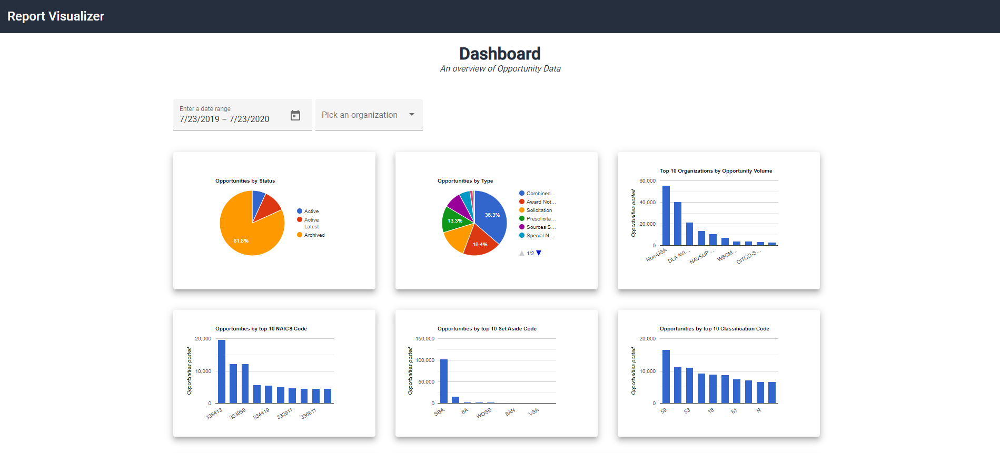

##	Opportunities Data Visualization

###	Piechart - Opportunities By Status
Display a pie-chart of Opportunities by Status. It includes active, active latest, archived opportunities.

###	Piechart - Opportunities By Type
The pie-chart will include the following opportunity types.

| Code              | Description                                   |
| ----------------- | --------------------------------------------- |
| __o__	            | Solicitation                                  |
| __p__	            | Presolicitation                               |
| __k__	            | Combined Synopsis/Solicitation                |
| __r__	            | Sources Sought                                |
| __g__	            | Sale of Surplus Property                      |
| __s__	            | Special Notice                                |
| __i__	            | Intent to Bundle Requirements (DoD- Funded)   |
| __a__	            | Award Notice                                  |
| __u__	            | Justification and Authorization               |

###	Bar-chart - Opportunities by Organizations
 This bar chart displays the opportunities by Organization

###	Bar-chart - Opportunities by Naics Code
 This bar chart displays the opportunities by Naics Code

###	Bar-chart - Opportunities by Set Aside Code
 This bar chart displays the opportunities by Set Aside Code

###	Bar-chart - Opportunities by Classification Code
 This bar chart displays the opportunities by Classification Code

###	Map - Opportunities by States
 This bar chart displays the opportunities by Organization
